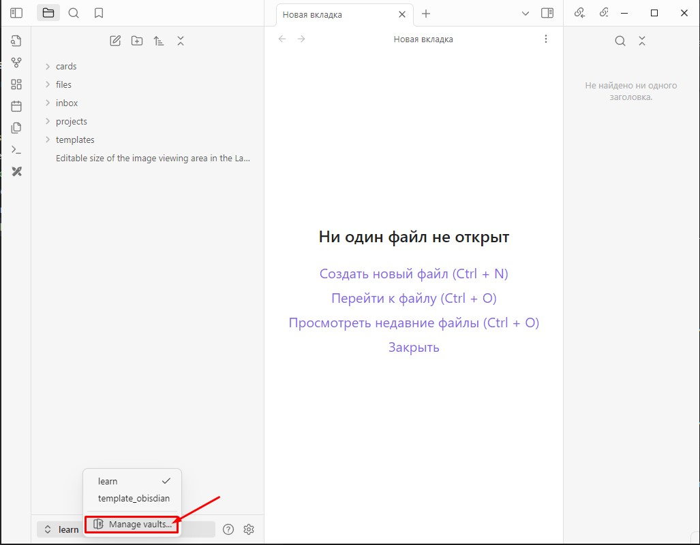

# Описание

* Проект содержит шаблон для распределенной работы команды с `Obsidian`([ссылка](https://obsidian.md/download)).
* Позволяет организовать распределенную Базу знаний (Вики) для команды.
* Из него может быть развернут публичный статический сайт.

Например на платформе `GitHub Pages`([ссылка](https://pages.github.com/)).
Благодаря этому, можно так же работать над документацией по своему проекту, используя возможности `Obsidian`([ссылка](https://obsidian.md/download)).

# Настройка

1. Скачайте и установите `Obsidian`([ссылка](https://obsidian.md/download)) для свой ОС и установите его.
2. Клонируйте себе данный репозиторий.
Выберите желаемую папку, и внутри нее в терминале выполните команду:
```
git clone git@github.com:medphisiker/multimodal_models_for_docs_wiki.git
```

Настройте свое `имя` и `email` для данного git-репозитория, выполнив команду:
```
git config --local user.name "YourName YouSurname"
git config --local user.email "your@email.adress"
```

Эта директория станет хранилищем для всех файлов и настроек `Obsidian`, она станет его `Vault`.

Далее будем называть эту папку `Obsidian Git Vault`.

3. Скачайте архив `template_obisdian_cfg.zip` из Google Drive папки [ссылка](https://drive.google.com/drive/folders/1GLPKjVHtxfcPXCeAq-5XCx_nXHbsejiy?usp=sharing).
4. Распакуйте скаченный архив внутри папки `Obsidian Git Vault`.
5. Проверьте полученную структуру каталога `Obsidian Git Vault`.

Она должна выглядеть так:
```
├───.obsidian
│   └───plugins
│       ├───better-export-pdf
│       ├───image-captions
│       ├───obsidian-excalidraw-plugin
│       ├───obsidian-paste-image-rename
│       ├───oz-clear-unused-images
│       └───tag-wrangler
├───cards
├───files
│   └───Excalidraw
│       └───Scripts
│           └───Downloaded
├───projects
├───repo_pics
└───templates
```

Для этого на `Windows` можно открыть `cmd`-терминал, на `Linux/Unix` их терминал внутри папки `Obsidian Git Vault` и выполнить команду:
```
tree
```

6. Выбираем в программе `Obsidian` в качестве нашего хранилища папку `Obsidian Git Vault`.

Шаг 1 Запускаем программу `Obsidian`

Если у Вы уже используете `Obsidian`, он откроет ваше личное хранилище.

Вам нужно будет переключится на хранилище указав нашу папку `Obsidian Git Vault`.



Если программы `Obsidian` ранее не было у вас на ПК она сама при своем первом запуске предложит Вам выбрать папку для хранилища.

Шаг 2 Выбираем папку `Obsidian Git Vault` как хранилище


Шаг 3 Доверится автору и включить плагины

После выбора папки `Obsidian Git Vault` в качестве хранилища для заметок, появится окно.

Оно сообщит Вам, что данное хранилище использует набор сторонних плагинов для `Obsidian`.

Так и было задумано, они были в архиве `template_obisdian_cfg.zip`, который мы распаковывали ранее.

Соглашаемся с активацией сторонних плагинов внутри нашего хранилища.


Шаг 4 Используем распределенную базу знаний

1. Используем `Obsidian`, чтобы создавать заметки в формате `Markdown`-файлов.

* Синтаксис Markdown: подробная шпаргалка для веб-разработчиков [ссылка](https://skillbox.ru/media/code/yazyk-razmetki-markdown-shpargalka-po-sintaksisu-s-primerami/)
* Курс по Obsidian [ссылка](https://youtube.com/playlist?list=PLeDR6lYFEHWEUxwSA8OplPLvk50DCVraH&si=vjNqi9xUT_rSRp74)
* An Introduction to Obsidian Properties [ссылка](https://obsidian.rocks/an-introduction-to-obsidian-properties/)
* How to Make a Template in Obsidian [ссылка](https://www.alphr.com/obsidian-how-to-make-a-template/)

2. Используем плагины `Obsidian`, которые мы активировали:

* **Excalidraw** ([ссылка](https://github.com/zsviczian/obsidian-excalidraw-plugin?tab=readme-ov-file)) - крутой плагин для создания диаграмм, редактирования картинок и т.д.

Можно использовать вместо Miro совместно всеми участниками проекта =)

Базовый набор его возможностей:
* Obsidian-Excalidraw 1.2.0 Walkthrough Part 1/10 (смотрим все 10 штук) [ссылка на 1 видео](https://youtu.be/sY4FoflGaiM?si=LUziSDrIEGsOEytF)
* YouTube Канал автора плагина [ссылка](https://www.youtube.com/@VisualPKM/playlists)
* Онлайн сервис Excalidraw на взаимодействии с которым построен плагин [ссылка](https://www.youtube.com/@VisualPKM/playlists)

Будем в нем рисовать красивые схемы/диаграммы/брейнштормить и т.д.

* **Better Export PDF** - позволяет экспортировать заметки в pdf файлы. Exalidraw - диаграммы будут преобразованы в картинки
* **Image Captions** - позволяет делать подписи рисункам
* **Paste image rename** - автоматически переименовывает картинки, которые мы вставляем в имя заметки.
* **Clear Unused Images** - перемещает все неиспользуемые картинки в корзину.

Использовать осторожно, плагины от `Exalidraw` он тоже стремится удалить.
